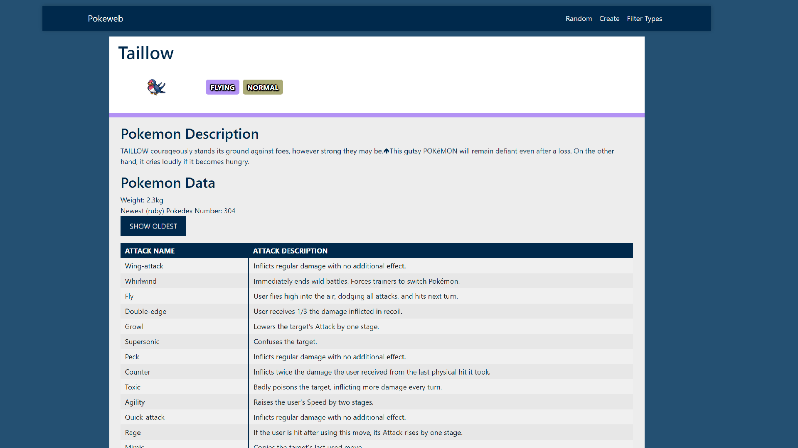
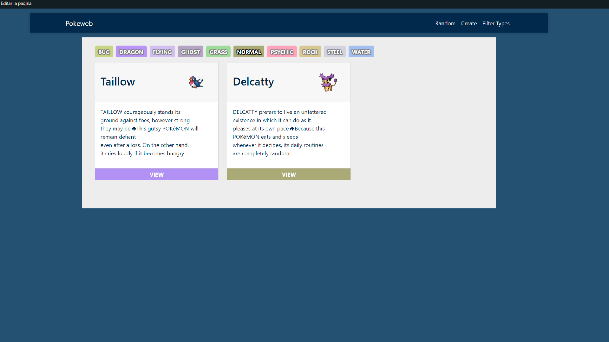
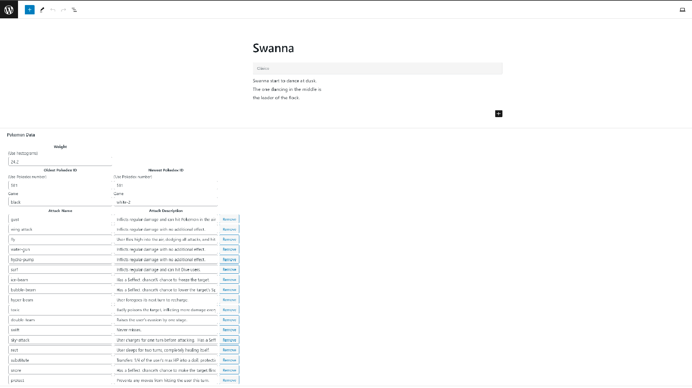

# README

## Setup

Install XAMPP (https://www.apachefriends.org/download.html) and download the latest version of WordPress (https://es.wordpress.org/download/). 

Once XAMPP is installed, you need to follow the WordPress installation process. To do this, move the WordPress files to your xampp/httdocs folder and access its new location with the browser. This will take you to the WordPress install wizard, where you should select a new database and introduce the credentials for the site.

Once the installation process is done move the original Understrap and the Understrap-child themes to your WordPress's theme folder.

After you have copied the themes import the file wp_pokeweb.sql as a new DB to PHPMyAdmin. Then go to your wp-config.php file and change the credentials and name of the DB. Now that your WordPress is using the imported DB you can log-in with the username: `admin` and the password: `d7bFT**5ce)oFJmHgkf)LAyl`

Additionally, to run TypeScript files this project uses npm, so open a terminal, navigate to the child theme directory and run `npm install`.

## Structure of the site

The new child theme has 3 pages, two custom API endpoints and modifications to the admin page.

### Random

A very simple URL that will select a stored Pokemon at random and redirect the user to it's page.

### Create

This URL will call the function `download_random_pokemon_data()` from functions.php. This will find a Pokemon on PokeAPI that hasn't been downloaded to the DB, download its data, generate a new page, and redirect the user to it.

An unlogged user or a user that doesn't have enough permissions will instead be showed a message warning him he can't download new data to the DB

### Filter Types

On this page we can see every stored Pokemon, paginated by 6, and filters to change which ones are displayed based on their types. The filters use URL parameters to tell the server which Pokemon to display.

### WP Admin modifications

Additionally, there's a new menu on the admin page, Pokemon, which can be used to manage the Pokemon posts and their categories.

On the edit page for each Pokemon there are new custom inputs to edit and save the meta values: weight, oldest and newest Pokedex IDs, attack names and descriptions and the PokeAPI ID. The inputs use the MetaBox and an action on save_post to collect the data.

### Custom API endpoints

The new child theme also includes two custom endpoints to download Pokemon data via REST API. 

The first one can be accessed on the URL `http://localhost/{site name}/wp-json/pokemon/v1/list` when the site is running, and will return a JSON containing the API IDs of every stored Pokemon.

`[{"name":"Girafarig","api id":"203"},{"name":"Swanna","api id":"581"}]`

The second one `http://localhost/{site name}/wp-json/pokemon/v1/{id}` takes one of the IDs returned by the first one and returns the full information stored for that Pokemon as a JSON.

`[
    {"name":"Swanna",
    "description":"Swanna start to dance at dusk.\nThe one dancing in the middle is\nthe leader of the flock.",
    "newest pokedex id":"581",
    "oldest pokedex id":"581",
    "oldest pokedex id game":"black",
    "newest pokedex id game":"white-2",
    "primary type":"flying",
    "secondary type":"water",
    "weight":"24.2",
    "attacks":[
        {"name":"gust",
        "description":"Inflicts regular damage and can hit Pok\u00e9mon in the air."},
        {"name":"wing-attack",
        "description":"Inflicts regular damage with no additional effect."}
    ],
    "api id":"581"}
]`

## Future development

### DAPI

If I needed to integrate DAPI for this site there would have to be a new Post Type for the Digimon, with its corresponding templates. On a data level it would be better to store all the Pokemon data on a single usermeta to have the methods that treat it be more abstract, so they can be used with Digimon data also.

This would require a change to how templates work, because they would have to take care of unpacking and formatting the data. But it would make future extensions much easier.

### Redis

In the event that the project receives a lot of traffic it would be wise to implement a caching system like Redis. Redis works as a database, but it's stored directly on memory instead of storage like most databases. This allows it to work as a cache intermediary for other databases.

The easiest way to integrate a Redis cache into WordPress is using the Redis Object Cache plug-in (https://es.wordpress.org/plugins/redis-cache/) and installing Redis directly in your server. This setup gathers information every time someone accesses a page and saves it as cache, automatically managing priorities. It is also very customizable.